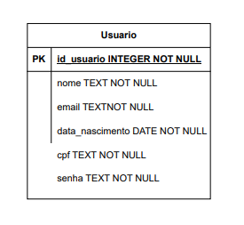
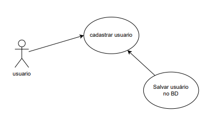

# Sistema de cadastro de usuários:
Sistema de cadastro de usuários feito em html, css, javascript, python e flask.

# Requisitos do sistema:
RF001: O sistema deve cadastrar o usuário com suas informações
RF002: O sistema deve verificar se os dados informados pelo usuário são válidos
RF003: O sistema exibir se o usuário foi cadastrado corretamente ou não

RNF001: O front-end deve ser feito em html, css e javascript.
RNF002: O back-end deve ser feito em python, utilizando flask.
RNF003: O sistema deve amazenar o usuário cadastrado no BD SQLite.
RNF004: O sistema deve ser seguro.
RNF005: O sistema de ser de fácil uso.

# Diagrama Entidade Relacional:

# Diagrama de caso de uso:
