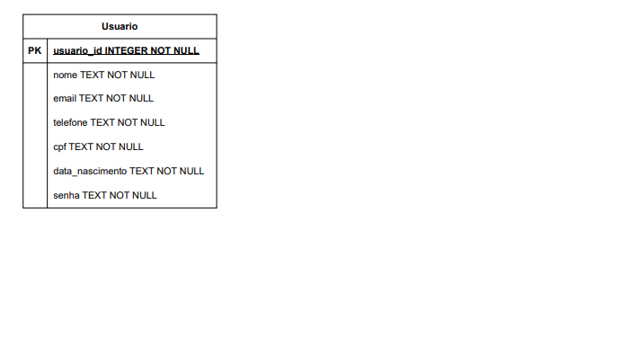
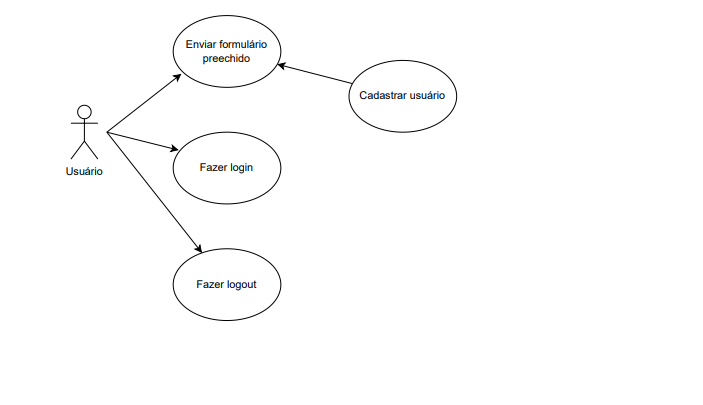
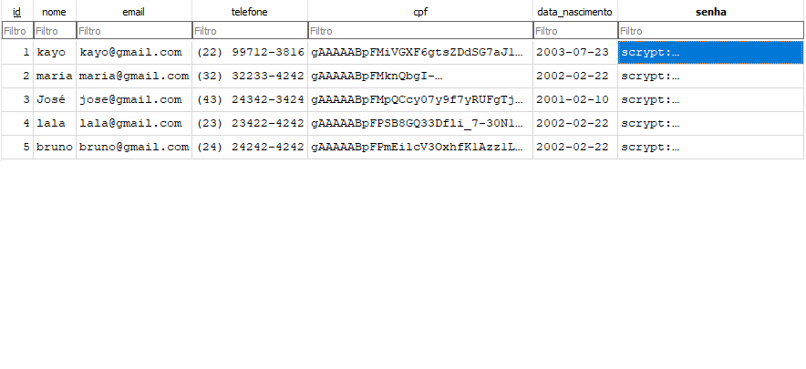

# Sobre o projeto:
O projeto desenvolvido é uma aplicação web feita para o cadastro e login de usuários de uma bibliteca, foi desenvolvido utilizando Python, flask e outras bibliotecas no back-end e HTML, CSS e JavaScript no front-end. O sistema foi projetado para ser simples, responsivo e seguro, podendo servir como base para sistemas maiores de bibliotecas que necessitem de controle de acesso.  
Pode ser acessado em: https://cadastro-web-0hmu.onrender.com   

# Tecnologias utilizadas
HTML: Sigla para HyperText Markup Language, é uma linguagem de marcação usada para criar estruturas de páginas web a partir de tags.  
CSS: Sigla para Cascading Style Sheets, linguagem usada para estilizar arquivos feitos em HTML.  
Javascript: Linguagem de programação utilizada para desenvolver interação dinâmica em sites.  
Python: Linguagem de programação versátil, utilizada para desenvolvimento web, machine learning, ciência de dados, automação de tarefas, entre outros.  
Flask: Micro-framework de Python utilizado para desenvolvimento web e apis.  
cryptography.fernet, python-dotenv, os e sqlite3: bibliotecas utilizadas para acessar e guardar dados de forma segura.  

# Requisitos do sistema
Requisitos funcionais:  
RF001: O sistema deve permitir o cadastro de novos usuários com as informações: nome, e-mail, telefone, CPF, data de nascimente e senha.  
RF002: O sistema deve validar os dados informados pelo usuário antes de cadastrar-lo.  
RF003: O sistema deve exibir mensagens de erro caso o formulário seja preenchido incorretamente.  
RF004: O sistema deve exibir uma confirmação de sucesso após o cadastro ser realizado.  
RF005: O sistema deve permitir que o usuário realize login com e-mail e senha.  
RF006: O sistema deve impedir o acesso a páginas restritas sem que o usuário esteja autenticado.  
RF007: O sistema deve permitir que o usuário encerre sua sessão. Fazer logout.  
RF008: O sistema deve criptografar dados sensíveis (CPF e senha) antes de cadastrar o usuário.  

Requisitos não funcionais:  
RNF001: O front-end deve ser desenvolvido com HTML5, CSS3 e JavaScript.  
RNF002: O back-end deve ser desenvolvido em Python, utilizando o framework Flask.  
RNF003: O sistema deve utilizar o banco de dados SQLite para armazenamento local. 
RNF004: O sistema deve armazenar o CPF no BD de forma criptografada com uma chave para criptografia e descriptografia.  
RNF005: O sistema deve armazenar a senha no BD de forma criptografada, utilizando hash.     
RNF006: O sistema deve utilizar a biblioteca python-dotenv para para leitura de variáveis de ambiente.  
RNF007: O sistema deve utilizar a biblioteca os para acesso seguro a variáveis do sistema.  
RNF008: O sistema deve utilizar a biblioteca sqlite3 para fazer a conexão com o banco de dados.  
RNF009: O sistema deve armazenar chaves secretas e senhas apenas em variáveis de ambiente, no arquivo .env.  
RNF010: O sistema deve utilizar sessão para manter o estado do login do usuário.  
RNF011: O sistema deve ser seguro contra vazamento de dados sensíveis.  
RNF012: O sistema deve ser de fácil uso e ter interface intuitiva.  
RNF013: O sistema deve ser responsivo, adaptando-se a diferentes tamanhos de tela.  
RNF014: O sistema deve ser hospedado em serviços gratuitos como Render, Vercel e Netlify.  

# Diagrama Entidade Relacional:

# Diagrama de caso de uso:

# dados salvos no BD:
